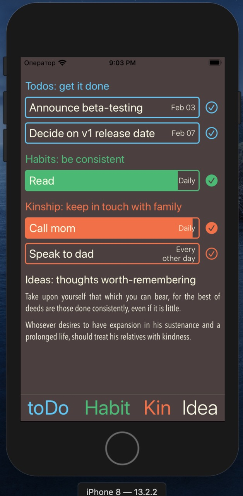
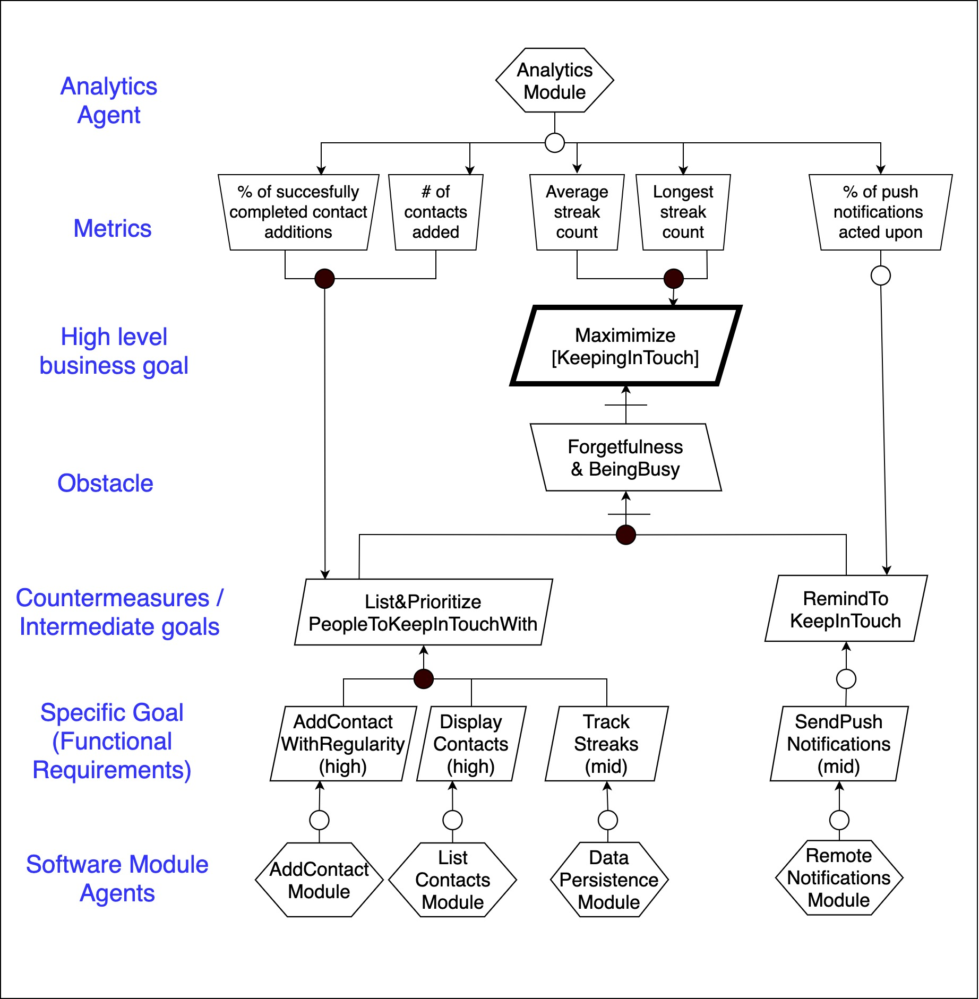

# KinApp

As-salaamu 'alaikum! 

The app's idea is to help Muslims organize their personal life and commitments. During the course we’ve implemeted a super-basic MVP version. Then, having some free time, we've decided to polish it further and add several more features.

The current version allows you to add and track:
- single-time todos
- personal habits, occurring on regular basis
- keep-in-touch reminders, which tell you to contact your friends & relatives

Some future features might include:
- history of when and what was done
- streaks for habits
- push notifications as reminders

The main challenges are:
1. keeping the app both lightweight and functional
2. understanding people's needs to tailor the app accordingly

So far, we've done some user interviews and mostly proceeded with building an app that fits our own needs, hoping that they correspond with those of our users. Now is the time to beta-test it and see if our assumption were correct.

The goal model below shows how the Keep-in-Touch functionality was arrived at, and what metrics need to be integrated into the product.

